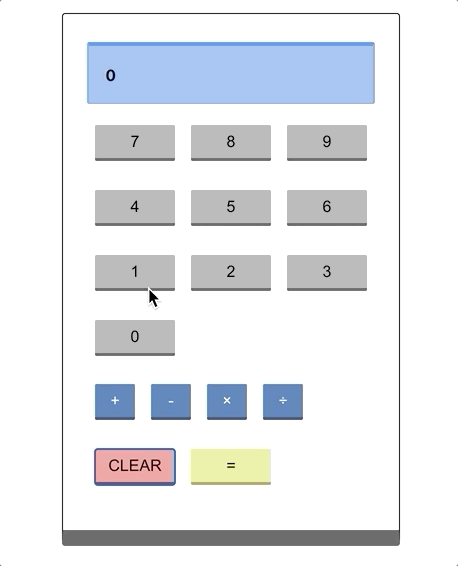

# react-calculator
- simple calculator application using React with pre-16.8 style state management to practice the older methods. 
- can multiply, add, subtract, and divide (technology has come a long way, hasn't it?)
